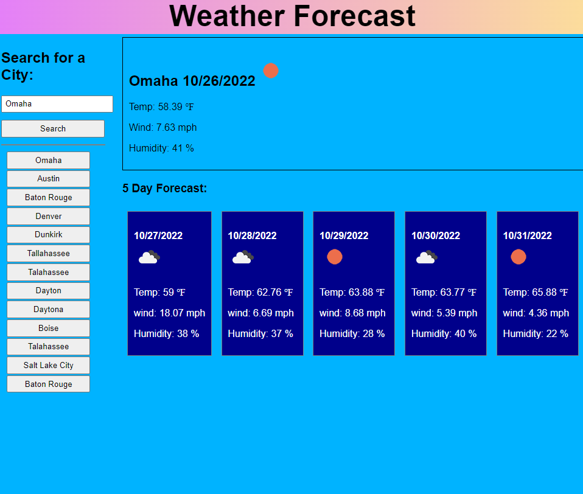

# Weather Forecast Challenge

## Description

Enter a city name in the search and you will receive a weather report for that city including the current conditions and a five day forecast for that city as well. After searching for the city, it will be added as a button to a list of previous searches you can recall for current conditions.

## Screenshot

Below is a screenshot of the application.

## Usage

Go to the page: https://eljayman.github.io/06-weather-app-challenge/

Enter a city or two and see the weather!

## Credits

Page uses Day.js API: https://day.js.org/

and OpenWeather API: https://day.js.org/

## License

MIT license.
